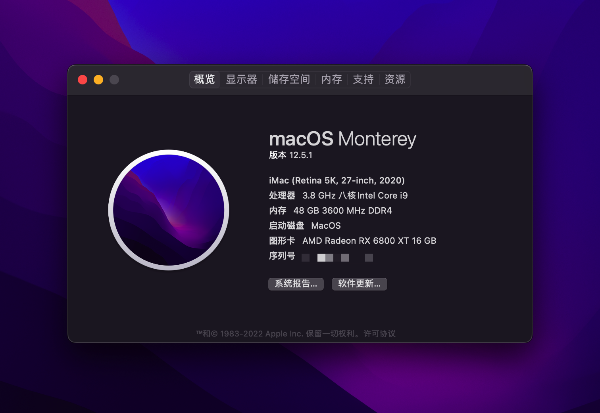

# 系统

MacOS Monterey 12.5.1

# 配置

|           | 型号                                  | 规格         |
| --------- | ------------------------------------- | ------------ |
| 主板      | MSI Z490 Gaming Plus                  |              |
| CPU       | Intel i7-10700K                       |              |
| 内存      | USCORSAIR复仇者RGB PRO DDR4 3600      | 16G\*2 8G\*2 |
| 显卡      | 蓝宝石 6800xt                         |              |
| 网卡      | Realtek RTL8125B 2.5 Gigabit Ethernet |              |
| WIFI&蓝牙 | 奋威T919                              |              |
| SSD存储   | 三星980 Pro 西部数据 sn850       | 1T 1T   |
| 机械存储  | 西部数据Bluedisk                      | 6T           |

# 运行情况

- [x] 核显
- [x] 独显
- [x] 有线网络
- [x] wifi&蓝牙
- [x] 接力
- [x] CPU睿频
- [x] 睡眠+唤醒
- [x] 隔空投送
- [x] Apple Watch解锁